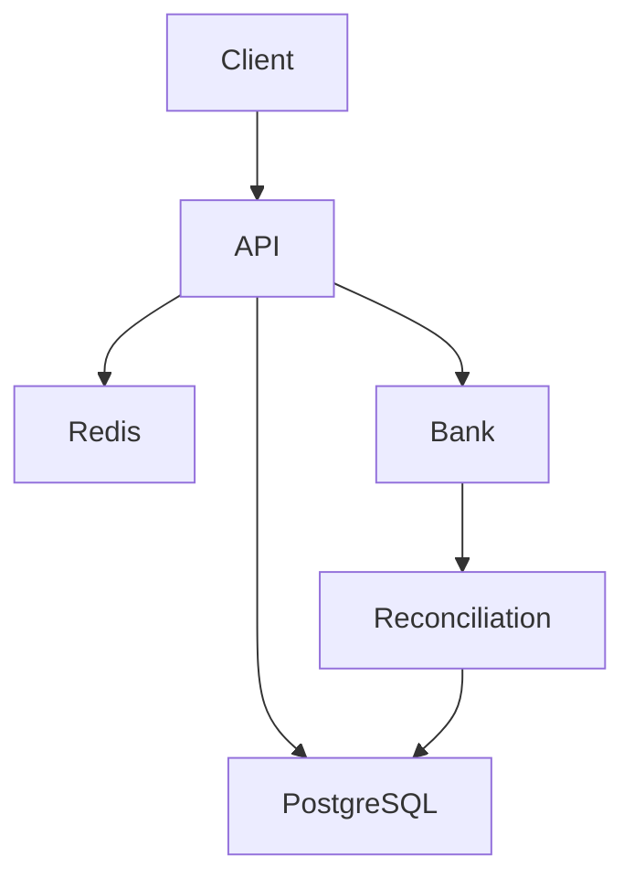

# Architecture

```mermaid
flowchart TD
    Client --> API
    API --> Redis
    API --> PostgreSQL
    API --> Bank
    Bank --> Reconciliation
    Reconciliation --> PostgreSQL
```

This system utilizes atomic Redis locks for idempotency and PostgreSQL for permanent storage.
